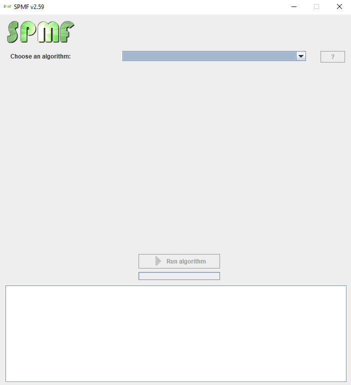
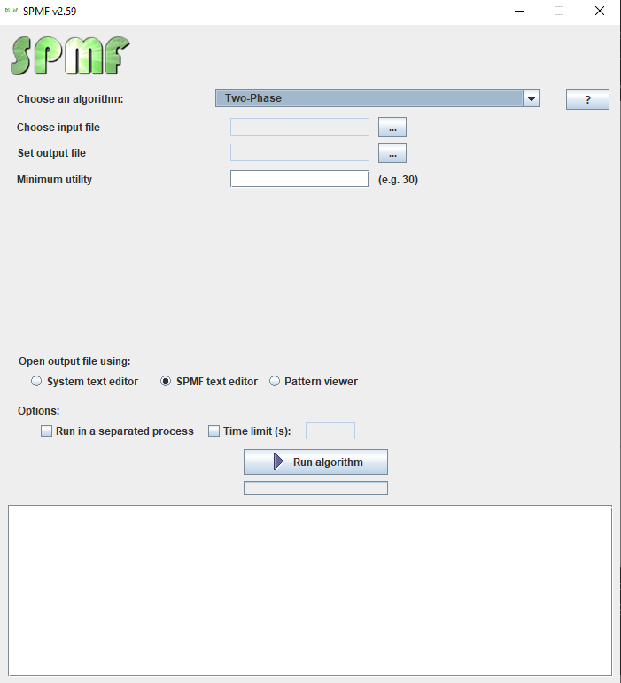
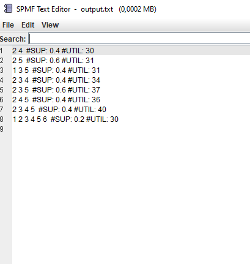
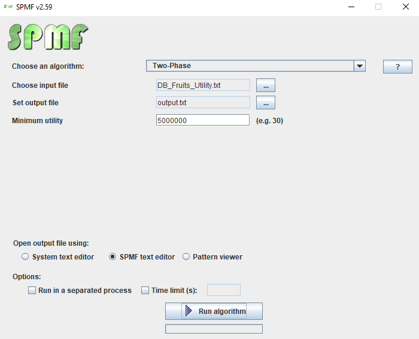
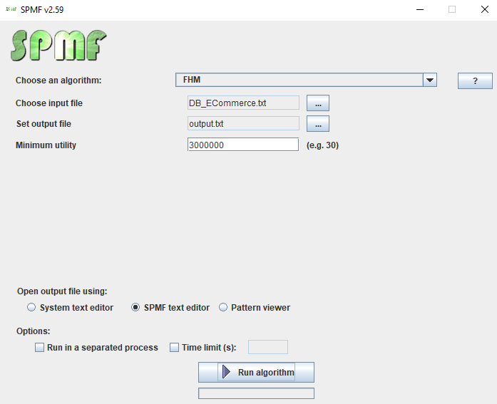

# Seminário - A Survey of High Utility Itemset Mining

## Instalação do SPMF para mineração de itemsets de alta utilidade

Existem duas versões do SPMF, a versão de código fonte e a versão de lançamento. Por praticidade será utilizada a versão de lançamento que é mais fácil de ser usada e possui uma interface gráfica e de linha de comando.

Primeiramente, certifique-se se ter pelo menos a versão 1.8 do Java instalado na sua máquina. Siga as instruções no [guia de instalação java](https://www.java.com/pt-BR/download/help/download_options_pt-br.html) caso ainda não tenha o Java instalado.

## Formato de entrada dos dados

Os arquivos de entrada para algoritmos de mineração de itemsets com alta utilidade são do tipo txt e tem duas partes no seguinte formato:

### 1º parte (opcional): Nomeação dos itens presentes do banco

- Linhas começando com @
- Primeira linha com "@CONVERTED_FROM_TEXT"
- Demais linhas fazem a ligação do item com sua descrição no formato @ITEM={ID}={DESCRICAO}
    - {ID} é o número do item
    - {DESCRICAO} é o nome do item
- Exemplo (DB_Fruits_Utility.txt):

    ```
    @CONVERTED_FROM_TEXT
    @ITEM=9188=Rampe Leaves Dried 50g
    @ITEM=9189=Basil Seed 100g(casa casa)
    @ITEM=9182=Bread Crumbs 500g
    @ITEM=1220=artichokes baby
    @ITEM=9183=Mangal Chicken Masala 100g
    ...
    ```

### 2º parte: Dados das transações

- Linhas representam as transações
- Existem 3 colunas separadas pelo caractere ‘ : ’
    - Coluna 1 : itemset com os itens separados por espaço simples
    - Coluna 2 : utilidade total do itemset
    - Coluna 3 : utilidade respectiva de cada item do itemset separadas por espaço simples

- Exemplo (DB_utility.txt):
    
    ```
    3 5 1 2 4 6:30:1 3 5 10 6 5
    3 5 2 4:20:3 3 8 6
    3 1 4:8:1 5 2
    3 5 1 7:27:6 6 10 5
    3 5 2 7:11:2 3 4 2
    ```
    

As duas partes devem ser concatenadas no mesmo arquivo de entrada.

## Utilizando a interface gráfica (somente Windows)

- Para usar o software SPMF, execute o arquivo spmf.jar presente neste repositório. Se isso não funcionar, utilize o botão direito sobre o arquivo e selecione a opção “abrir com..” e depois selecione a plataforma do Java. Se o Java estiver instalado e ainda não funcionar no Windows, você também pode tentar clicar duas vezes no arquivo START_SPMF.bat para executar o SPMF.
- Se tudo estiver ocorrido bem, a seguinte janela será aberta:



- Através do primeiro formulário escolha o algoritmo que deseja utilizar, com isso serão mostradas mais opções como na imagem a seguir:



- Selecione o arquivo de entrada seguindo o formato mencionado anteriormente.
- Indique onde será criado o arquivo de saída, por exemplo um arquivo output.txt na pasta raiz do repositório.
- Por fim, selecione qual a utilidade mínima desejada para execução do algoritmo, por exemplo 30.
- Clique em Run algorithm para executar o algoritmo.
- Será aberta uma nova janela com os resultados encontrados pelo algoritmo. Esse mesmo texto também será encontrado no arquivo de saída selecionado.



- O resultado indica os itemsets que tiveram a utilidade maior que o valor do parâmetro escolhido, o suporte do itemset (para alguns algoritmos isso não é mostrado), que é representado pela porcentagem da base que contém esse itemset, e a utilidade do itemset.

- Caso o arquivo de entrada contenha também a nomeação dos itens, serão mostrados os nomes dos itens ao invés dos respectivos números

## Utilizando a interface de linha de comando

- Para usar o SPMF pela linha de comandos basta executar o arquivo spmf.jar presente no repositório a partir de um comando Java no terminal.
    ```
    java -jar spmf.jar run ALGORITMO ARQUIVO_ENTRADA ARQUIVO_SAIDA UTILIDADE_MIN
    ```
- ALGORITMO: representa o algoritmo que se deseja utilizar. É possível encontrar os algoritmos no link [https://www.philippe-fournier-viger.com/spmf/index.php?link=algorithms.php](https://www.philippe-fournier-viger.com/spmf/index.php?link=algorithms.php)
- ARQUIVO_ENTRADA: representa o caminho do arquivo que se deseja utilizar como entrada dos dados no formato especificado anteriormente
- ARQUIVO_SAIDA: representa o caminho do arquivo que será criado como resultado do algoritmo
- UTILIDADE_MIN: representa o parâmetro de utilidade mínima usado no algoritmo
- Exemplo
    
    ```
    java -jar spmf.jar run Two-Phase DB/DB_Utility.txt output.txt 30
    ```
    
- Executando o comando será criado o arquivo de saída contendo as informações do resultado do algoritmo.
- Exemplo
    
    ```
    2 4  #SUP: 0.4 #UTIL: 30
    2 5  #SUP: 0.6 #UTIL: 31
    1 3 5  #SUP: 0.4 #UTIL: 31
    2 3 4  #SUP: 0.4 #UTIL: 34
    2 3 5  #SUP: 0.6 #UTIL: 37
    2 4 5  #SUP: 0.4 #UTIL: 36
    2 3 4 5  #SUP: 0.4 #UTIL: 40
    1 2 3 4 5 6  #SUP: 0.2 #UTIL: 30
    ```
    
- O resultado indica os itemsets que tiveram a utilidade maior que o valor do parâmetro escolhido, o suporte do itemset (para alguns algoritmos isso não é mostrado), que é representado pela porcentagem da base que contém esse itemset, e a utilidade do itemset.

- Caso o arquivo de entrada contenha também a nomeação dos itens, serão mostrados os nomes dos itens ao invés dos respectivos números

## Exemplo adicional 1

- Utilizando o algoritmo Two-Phase serão minerados os itemsets de alta utilidade presentes no banco DB_Fruits_Utility.txt
- Para isso será utilizada a seguinte configuração na interface:



- Ao rodar o algoritmo obtemos o seguinte resultado:

    ```
    Capsicum red  #SUP: 0.06272462493817663 #UTIL: 5735007
    Cucumber Lebanese  #SUP: 0.05776226850579766 #UTIL: 5258961
    Eggplant  #SUP: 0.04276529098203 #UTIL: 5480160
    Garlic loose  #SUP: 0.04107819970324779 #UTIL: 7492000
    Ginger  #SUP: 0.03442875199208661 #UTIL: 6279000
    Mushroom Cup  #SUP: 0.035159641699181184 #UTIL: 5763489
    Field Tomatoes  #SUP: 0.11154036379623015 #UTIL: 6107673
    Banana Cavendish  #SUP: 0.2375501456284003 #UTIL: 8695504
    ```

- Com isso, podemos verificar os conjuntos de frutas que geram maior valor para esse mercado.

## Exemplo adicional 2

- Utilizando o algoritmo FHM serão minerados os itemsets de alta utilidade presentes no banco DB_ECommerce.txt
- Para isso será utilizada a seguinte configuração na interface:



- Ao rodar o algoritmo obtemos o seguinte resultado:

    ```
    CHILLI LIGHTS #UTIL: 3180086
    JUMBO BAG STRAWBERRY JUMBO BAG PINK POLKADOT JUMBO BAG RED RETROSPOT #UTIL: 3310366
    JUMBO BAG STRAWBERRY JUMBO BAG RED RETROSPOT #UTIL: 3961780
    JUMBO BAG PINK POLKADOT JUMBO BAG RED RETROSPOT #UTIL: 3786534
    26252829 #UTIL: 4570413
    PARTY BUNTING #UTIL: 4825546
    ASSORTED COLOUR BIRD ORNAMENT #UTIL: 3451370
    CREAM HANGING HEART T-LIGHT HOLDER #UTIL: 5406791
    REGENCY CAKESTAND 3 TIER #UTIL: 8560695
    JUMBO BAG RED RETROSPOT #UTIL: 6253905
    ```

- Com isso, podemos verificar os conjuntos de produtos que geram maior valor para esse mercado.

## Referência

[SPMF - An Open-Source Data Mining Library](https://www.philippe-fournier-viger.com/spmf/index.php)
